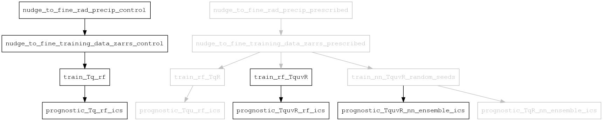
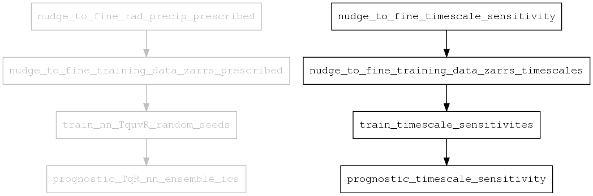

# nudge-to-fine-3km-manuscript-workflow
A reproducible set of workflows for the N2F-3km manuscript

The repository consists of two major types of configurations:
1) argo workflows for generating the data used in machine learning, training models, and running the FV3GFS model prognostically
2) using data generated above, scripts and notebooks for generating the figures in the manuscript


Repository structure:
```
├── LICENSE
├── Makefile
├── README.md
├── install_kustomize.sh
├── kustomization.yaml
├── kustomize
└── workflows
    └── nudge-to-fine-run
    └── prognostic-run
    └── prognostic-run-report
    └── train-evaluate-prognostic-run
```

# Reproducing the results

Running the make commands in the order shown in the DAGs below will reproduce the experiments described in this paper. The final steps of `make figures_*` can either be run as a make command or the individual notebooks in the `notebooks` directory can be executed to interactively view the results figures as they are created.


#### Main experiment
This DAG outlines how to generate our main results for the random forest and neural network ensemble trained on nudged-to-3km dataset with surface fluxes and precipitation prescribed from the fine resolution reference.


#### Ablation study
This DAG outlines how to generate the results of our sensitivity study testing the effects of i) prescribing surface radiative fluxes and precipitation to the fine res reference in the nudged training run, ii) predicting $Tq$ tendencies vs. $Tquv$ tendencies, and iii) using a neural net versus a random forest
Greyed out boxes indicate steps that have already been completed, assuming the workflow in the main experiment DAG for the main experiment has already run.


#### Nudging timescale sensitivity
This DAG outlines how to generate the results of the nudging timescale sensitivity study. It runs the 1, 6, and 12 hr nudging timescales (the 3 hr timescale results are from the
main experiment) for both $TqR-NN$ and $TquvR-NN$ models. Greyed out boxes indicate steps that have already been completed, assuming the workflow in the main experiment DAG for the main experiment has already run.
